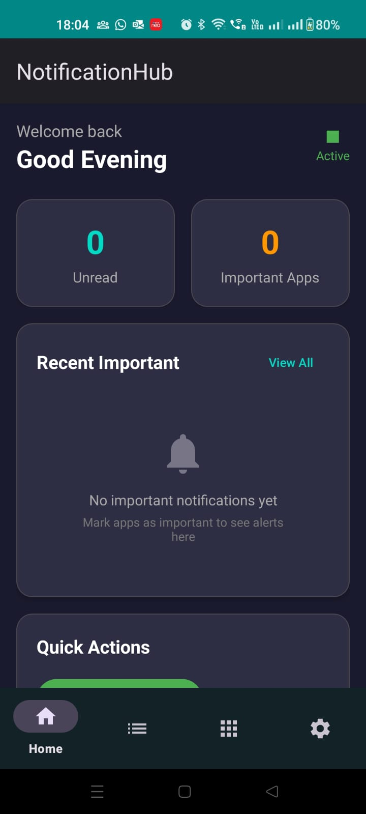
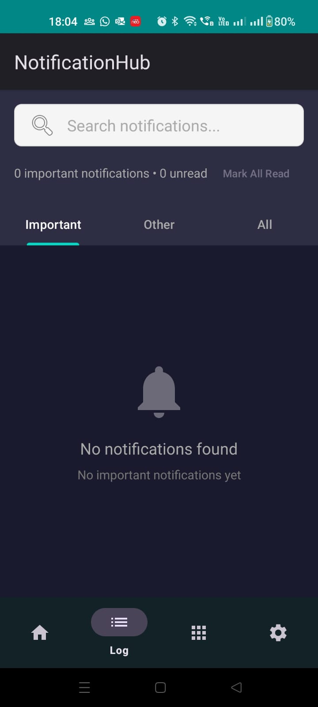
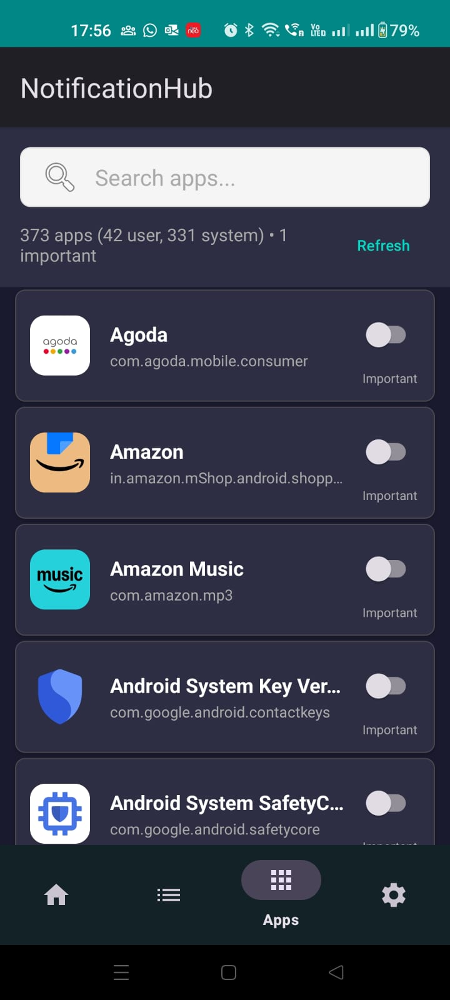
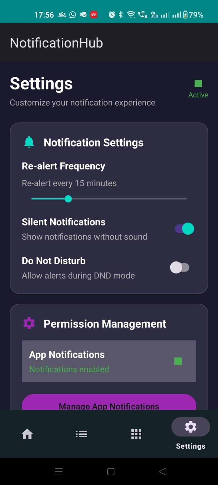

# NotificationHub 🔔

> **Smart Notification Manager with Re-Alerts and Privacy-First Design**

NotificationHub is an intelligent Android notification management app that helps you never miss important notifications through smart filtering, customizable re-alerts, and comprehensive privacy protection.

## 📱 Screenshots

| Home Screen | Notification Log | App Management | Settings |
|-------------|------------------|----------------|----------|
|  |  |  |  |

## ✨ Features

### 🎯 **Smart Notification Management**
- **Intelligent Filtering**: Automatically categorize notifications as important or regular
- **App-Specific Settings**: Customize importance levels for individual apps
- **Quick Actions**: Mark all as read, manage apps, and view detailed logs

### ⏰ **Re-Alert System**
- **Customizable Intervals**: Set re-alerts from 1-60 minutes
- **Silent Mode**: Default silent notifications with optional sound
- **DND Respect**: Honors Do Not Disturb settings

### 🔒 **Privacy First**
- **Local Storage Only**: All data stored locally on your device
- **No Cloud Sync**: Zero external data transmission
- **No Tracking**: No analytics, user profiling, or data collection
- **Encrypted Storage**: Industry-standard local encryption

### 🎨 **Modern Design**
- **Material Design 3**: Beautiful, intuitive interface
- **Dark Theme**: Battery-optimized dark interface
- **Multi-Language**: Support for English and Hindi
- **Accessibility**: Follows Android accessibility guidelines

## 🚀 Getting Started

### Prerequisites
- Android 8.0+ (API level 26)
- 10MB available storage
- Notification access permission

### Installation

#### From Google Play Store
```
Coming Soon - Search for "NotificationHub" by TeckGrow Consultancy
```

#### Manual Installation (Development)
1. Download the APK from releases
2. Enable "Install from unknown sources"
3. Install the APK
4. Grant notification access permission

### First-Time Setup
1. **Welcome Screen**: Learn about NotificationHub features
2. **Permission Setup**: Grant notification access permission
3. **App Configuration**: Set important apps in the Apps tab
4. **Customize Settings**: Adjust re-alert intervals and preferences

## 🏗️ Architecture

### Tech Stack
- **Language**: Kotlin
- **Architecture**: MVVM with Repository Pattern
- **Database**: Room (SQLite with encryption)
- **UI Framework**: Android View System with Material Design 3
- **Background Processing**: NotificationListenerService, WorkManager
- **Dependency Injection**: Manual DI with Singleton pattern

### Project Structure
```
app/
├── src/main/java/com/notificationhub/
│   ├── data/              # Data layer (database, repositories)
│   │   ├── database/      # Room database and DAOs
│   │   ├── entity/        # Data entities
│   │   └── repository/    # Repository implementations
│   ├── service/           # Background services
│   │   ├── SmartNotificationListenerService.kt
│   │   └── ReAlertService.kt
│   ├── ui/                # Presentation layer
│   │   ├── adapter/       # RecyclerView adapters
│   │   ├── fragment/      # UI fragments
│   │   └── viewmodel/     # ViewModels
│   ├── utils/             # Utility classes
│   └── receiver/          # Broadcast receivers
├── res/                   # Resources (layouts, strings, colors)
└── assets/               # App assets (privacy policy, etc.)
```

### Key Components

#### 1. **SmartNotificationListenerService**
- Listens to system notifications
- Filters and categorizes incoming notifications
- Stores important notifications in local database

#### 2. **ReAlertService**
- Manages background re-alert scheduling
- Respects user preferences and DND settings
- Optimized for battery efficiency

#### 3. **Repository Pattern**
- `NotificationRepository`: Manages notification data
- `AppPreferenceRepository`: Handles app importance settings
- Encrypted local storage with Room database

#### 4. **UI Architecture**
- Fragment-based navigation
- ViewModels for business logic
- LiveData for reactive UI updates

## 🔧 Development

### Building the Project

```bash
# Clone the repository
git clone https://github.com/yourusername/notificationhub.git
cd notificationhub

# Build debug APK
./gradlew assembleDebug

# Build release APK
./gradlew assembleRelease

# Run tests
./gradlew test
```

### Development Setup

1. **Android Studio**: Arctic Fox or later
2. **Kotlin**: 1.8+
3. **Gradle**: 8.0+
4. **Target SDK**: 34 (Android 14)
5. **Min SDK**: 26 (Android 8.0)

### Key Dependencies

```kotlin
// Core Android
implementation 'androidx.core:core-ktx:1.12.0'
implementation 'androidx.lifecycle:lifecycle-viewmodel-ktx:2.7.0'
implementation 'androidx.fragment:fragment-ktx:1.6.2'

// Database
implementation 'androidx.room:room-runtime:2.6.1'
implementation 'androidx.room:room-ktx:2.6.1'

// UI
implementation 'com.google.android.material:material:1.11.0'
implementation 'androidx.recyclerview:recyclerview:1.3.2'

// Background Work
implementation 'androidx.work:work-runtime-ktx:2.9.0'
```

## 📋 Permissions

### Required Permissions
- `android.permission.BIND_NOTIFICATION_LISTENER_SERVICE`: Core notification access
- `android.permission.POST_NOTIFICATIONS`: Display app notifications (Android 13+)
- `android.permission.FOREGROUND_SERVICE`: Background monitoring service

### Optional Permissions
- `android.permission.REQUEST_IGNORE_BATTERY_OPTIMIZATIONS`: Better background performance
- `android.permission.WAKE_LOCK`: Wake device for re-alerts

## 🛡️ Privacy & Security

### Data Protection
- **Local Storage**: All data stored locally using Room database
- **Encryption**: Sensitive data encrypted at rest
- **No Network**: Zero network requests or data transmission
- **No Analytics**: No user tracking or behavior analysis

### Permissions Transparency
- Only requests essential permissions for core functionality
- Clear explanation of permission usage
- User control over all app behaviors

## 🔄 Release Process

### Version Management
- **Semantic Versioning**: MAJOR.MINOR.PATCH format
- **Release Branches**: `release/v1.0.0`
- **Tags**: Git tags for each release

### Build Variants
- **Debug**: Development builds with logging
- **Release**: Production builds with ProGuard/R8 optimization

### Testing Strategy
- **Unit Tests**: Core business logic
- **Integration Tests**: Database and repository tests
- **Manual Testing**: UI flows and permissions

## 🤝 Contributing

We welcome contributions! Please see our [Contributing Guidelines](CONTRIBUTING.md) for details.

### Development Workflow
1. Fork the repository
2. Create a feature branch (`git checkout -b feature/amazing-feature`)
3. Commit your changes (`git commit -m 'Add amazing feature'`)
4. Push to the branch (`git push origin feature/amazing-feature`)
5. Open a Pull Request

### Code Style
- Follow Kotlin coding conventions
- Use meaningful variable and function names
- Add comments for complex logic
- Ensure proper error handling

## 📄 License

This project is licensed under the MIT License - see the [LICENSE](LICENSE) file for details.

## 🏢 About TeckGrow Consultancy

NotificationHub is developed by **TeckGrow Consultancy**, a technology company focused on creating privacy-first mobile applications that enhance productivity while respecting user privacy.

- **Website**: [teckgrow.com](https://teckgrow.com)
- **Privacy Policy**: [teckgrow.com/notification-hub-privacy-policy](https://teckgrow.com/notification-hub-privacy-policy.html)
- **Support**: Contact through Google Play Store or website

## 📞 Support

### Getting Help
- **App Issues**: Use the feedback option in Settings
- **Feature Requests**: Submit through GitHub Issues
- **Privacy Questions**: Check our comprehensive Privacy Policy

### FAQ

**Q: Does NotificationHub access my personal data?**
A: No. All data is stored locally on your device and never transmitted anywhere.

**Q: Why does the app need notification access?**
A: To read and filter your notifications. This permission is essential for the app's core functionality.

**Q: Will this affect my battery life?**
A: NotificationHub is optimized for minimal battery usage with efficient background processing.

**Q: Can I use this with other notification apps?**
A: Yes, NotificationHub works alongside other notification managers without conflicts.

## 🗺️ Roadmap

### v1.1 (Next Release)
- [ ] Notification scheduling and snoozing
- [ ] Advanced filtering rules
- [ ] Backup/restore settings (local only)
- [ ] Widget support

### v1.2 (Future)
- [ ] More language support
- [ ] Accessibility improvements
- [ ] Wear OS companion app
- [ ] Advanced statistics and insights

### v2.0 (Long-term)
- [ ] Machine learning-based importance detection
- [ ] Cross-device synchronization (optional, privacy-first)
- [ ] Enterprise features
- [ ] API for third-party integrations

---

**Made with ❤️ by TeckGrow Consultancy**

*Empowering productivity while protecting privacy.*